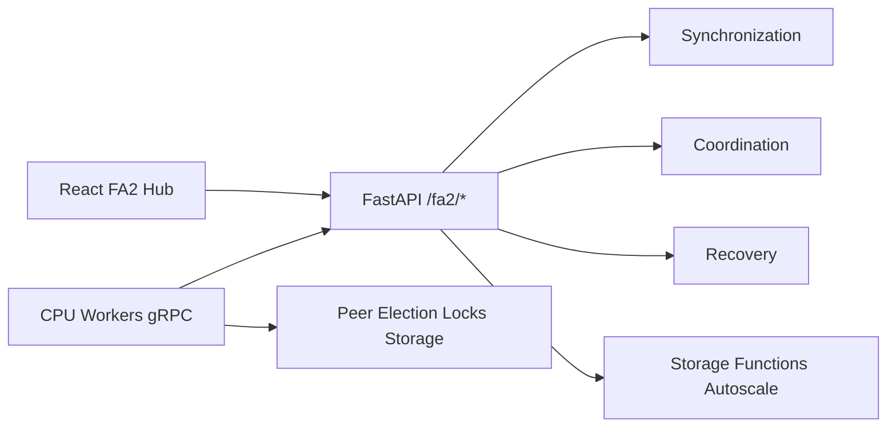

# FA2 Architecture

See phase docs `FA2_PHASE1.md`–`FA2_PHASE4.md` and final API reference `FA2_API_REFERENCE.md`.

```mermaid
flowchart LR
  UI[React FA2 Hub] --> API[FastAPI /fa2/*]
  API --> Sync[Synchronization]
  API --> Coord[Coordination]
  API --> Rec[Recovery]
  API --> Svc[Storage Functions Autoscale]
  Workers[CPU Workers gRPC] --> API
  Workers --> P2P[Peer Election Locks Storage]
```
